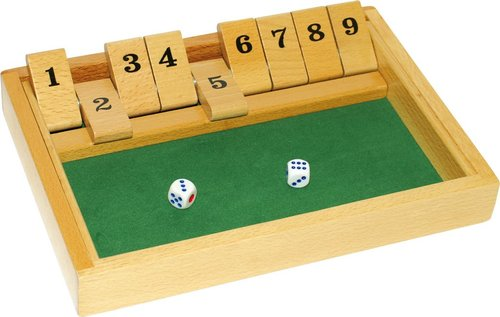
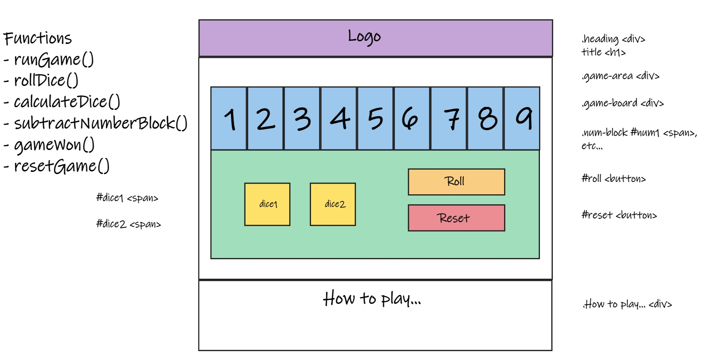
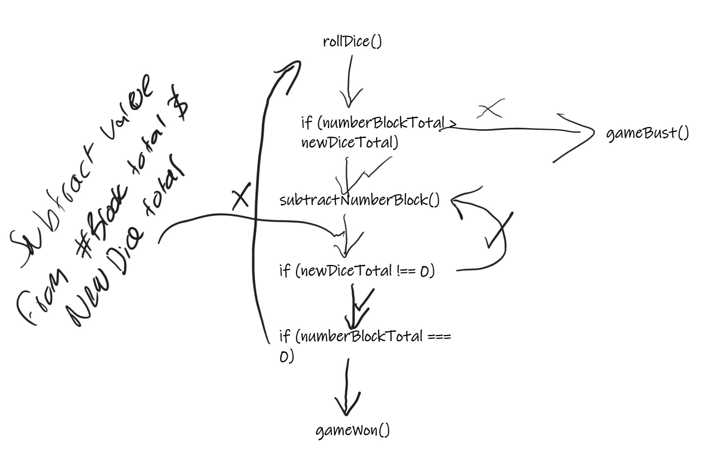
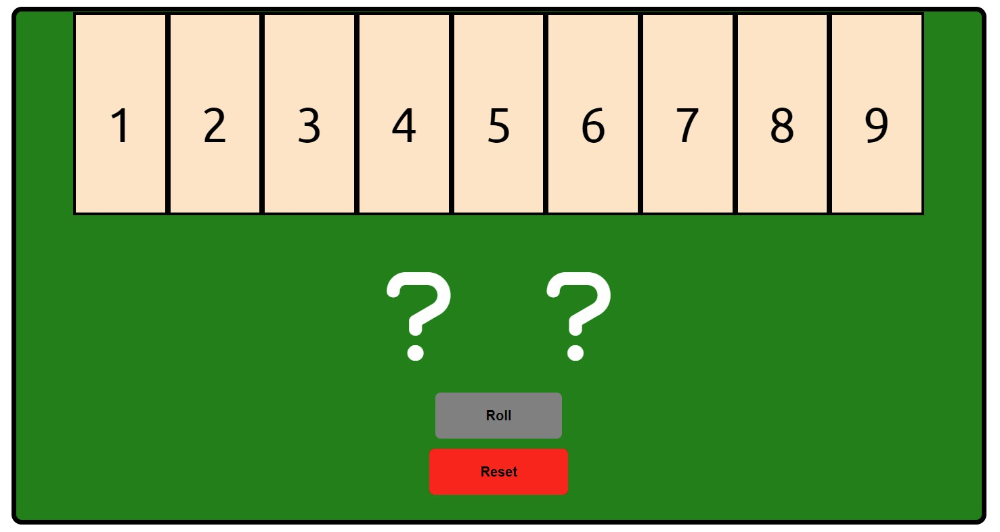
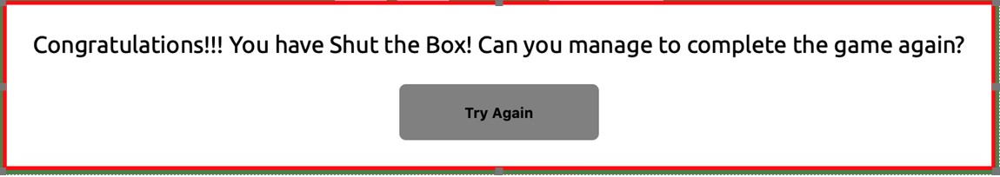
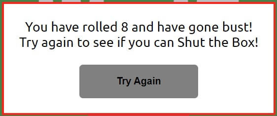
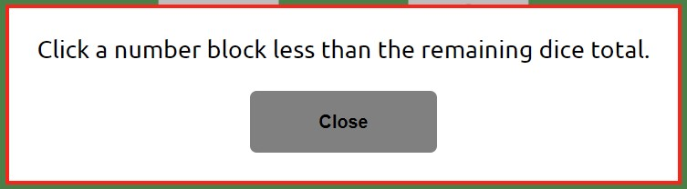
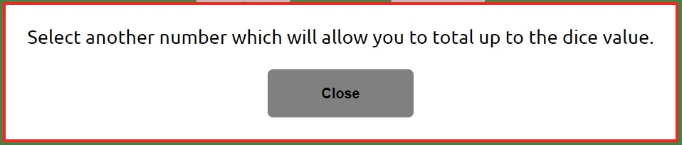
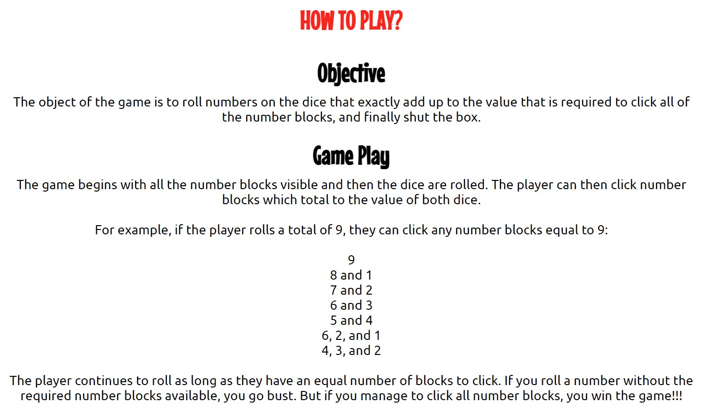
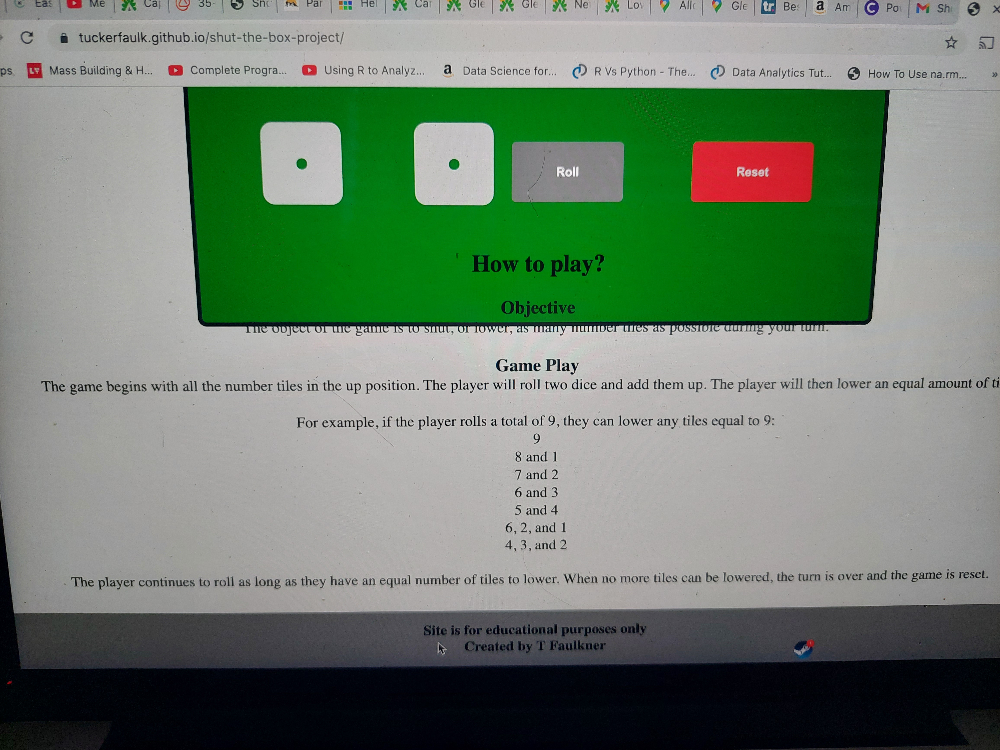

# Shut the Box | Dice Game! 

My idea for this project was to develop an online game of chance which players can enjoy: the game itself is a popular game played in Pub's in Suffolk.

The object of the game is to roll numbers on the dice that exactly add up to the value that is required to click all of the number blocks, and finally shut the box.

# Table of contents
- [Design](#design)
  - [Text and Background Color](#text-and-background-color)
  - [Game Area Design](#game-area-design)
  - [Game Process Planning (Flow Chart)](#game-process-planning-(Flow-Chart))
- [Features](#features)
  - [Existing Features](#existing-features)
    - [Languages Used](#languages-used)
    - [Header (including Navigation)](#Header-(including-Navigation))
    - [Game Area](#game-area)
    - [Pop-up Messages (Game Won, Game Bust, and Alerts)](#pop-up-messages-(game-won,-game-bust,-and-alerts))
    - [How to Play?](#how-to-play?)
    - [Footer](#footer)
    - [Other Features](#other-features)
  - [Future Features](#future-features)
- [Testing](#testing)
  - [Validator Testing](#validator-testing)
  - [Unfixed Bugs](#unfixed-bugs)
  - [Libraries & Programs Used](#libraries-and-programs-used)
- [Deployment](#deployment)
- [Credits](#credits)
  - [Content](#content)
  - [Media](#media)

# Design

**Text and Background Color**

I selected both the font style (Google Fonts: 'Mouse Memoirs' and 'Ubuntu') and background colors to keep the website simple. I wanted to keep the main background white but then use the colors of the Shut the Box board to ensure that it was the main central focus of the site. I decided to use grey for the header and the footer to provide contrast from the main sections.

**Game Area Design**

The game area is the main section of the site where the game can be played. The design of this area was based on the design of the Shut the Box board, as seen below.

After initially developing the game board area to exactly reflect the wireframing design, it was noted that by stacking the number blocks, dice and buttons, instead of having the dice and buttons next to each other, this significantly reduced on the changes required when adding the media queries and meant that the design remained consistent for the user across all screen sizes.

**Game Process Planning (Flow Chart)**

Flow charts were used during the planning stages of developing this site to set out the process plan for the JavaScript functions. I found that it was easier to use flow charts, rather than a list of steps, for designing the stages of the game given the conditional nature of this means.

After the site was developed in line with the initial flow chart planning, as seen above, after testing of the site, it was noted that further conditional checking was required to prevent game faults: details of these faults have been 

# Features

## Existing Features:

### Languages Used

- HTML5
- CSS3
- JavaScript

### Header (including Navigation)

The header includes the logo text to share the name of the game, and an icon of two dice has been used to give the user an idea of how to play the game. 

Finally, although there is only a single page with the 'How to play?' game rules located under the game area, it was noted during testing that on screens sizes with a smaller height, it was not immediately evident that these rules were available. By adding the "How to play?" button to the header, this solved this problem and also provided the user which a shortcut to this section of the page.

### Game Area

The game area is the main focus of the site which is why this is front and center when loading the site. The game board has been broken down into four sections:

  1. Game Board
  2. Number Blocks (Numbers 1 - 9)
  3. Dice Area (2 x Dice)
  4. Roll and Reset Buttons

I think the design provided keeps the site very simple and is very intuitive for the player to use.

### Pop-up Messages (Game Won, Game Bust, and Alerts)

After feedback from my mentor, I was advised against relying on alerts() as part of the operation of the game as these may not appear, or can be turned off, dependant on the players browser settings. As such, the following messages now appear to inform the play that they have won, gone bust, or have selected an incorrect number.

#### - Game Won

#### - Game Bust

#### - Alert Messages

#### How to Play?

Although the game is simple, I thought it would provide benefit to the player to include the rules, given this is not a familiar game to play. These are located under the game board, or a shortcut to them is available in the sites header.

### Footer

The footer section features a note that this site is for educational purposes only and details the name of the creator.

### Other Features

- Favicon: A Font Awesome Icon of two dice has been used for the Favicon as a finishing touch to the site.

## Future Features

- Numbers which can be selected based on the total dice value will be highlighted
- Animations to be added to the dice roll and the game won message
- Event listener to be added for keyboard use for selecting number blocks

# Testing

Testing of the website has been complete by myself and a few friends and family on various devices (Laptop, Tablet and Mobile). It is noted that the game and all of the pop-up messages (Game Won, Game Bust, and Alerts) functioned as expected.

To ensure that the website worked on different browsers than what was used for the development (Google Chrome), testing also took place on Microsoft Edge, Firefox and Safari.

Useful techniques used during the testing process:
- Writing pseudo code 
- Drawing function flow charts
- Adding console.log()s into functions

There were many bugs identified from the testing, development and feedback of this site. These have been listed below:

1. It was noted very early in testing that event listeners had to be removed after a number block had been selected. Without removing the event listeners, it allow to player to continue to select number blocks regardless of the dice total.

2. When rolling the dice, there was occasion that the same numbers were displayed. This was initially confusing as to whether the roll button had been clicked or not. Changes were made so the roll button disappears after it has been clicked.

3. The game would not notify the user that they had bust if a combination of their remaining number blocks did not total to the dice total. The solution to this was to use some code which created a new array of all combinations of an array of numbers. The original code used concatenated all combinations of a list of letters. This was update to collate an array of the remaining number blocks and then to add (instead of concatenate) all combinations of these numbers.

4. Feedback from family noted that they sometimes accidentally selected a number higher than the value of the dice which caused the game to bust. An message was included into the game to alert the player of this error and lets them select a new number.

5. There was an issue very early in the development of the site where the "How to Play?" section covered the game area on smaller screens (see image below). The initial thought was that the above sections "position" or "display" settings were preventing the blocks from stacking, but it was finally found that as the game-area section height was detailed using "vh", this caused the bug. Changing this to pixels fixed this bug.

6. Feedback from testing of friends and family noted that using two dice with both a value of one on the loading page was slightly confusing: as if the game had already started. The solution to this was to change the starting icons from a pair of dice to two questions marks.

## Validator Testing

- HTML: No errors were returned when passing through the official W3C validator.

- CSS: No errors were found when passing through the official (Jigsaw) validator.

- JSHint: Only one warnings was returned using (JSHint) with "New JavaScript features (ES6)" activated in the configuration, although this is not an issue. It is noted that this was a deliberate use of the bitwise operator. 

- Lighthouse (Accessibility Audit): The page achieved a great accessibility performance.

## Unfixed Bugs

There were no unfixed bugs identified during the testing of this site.

## Libraries and Programs Used

- Github: Store Repository
- Gitpod: Create the html and css files
- Google Fonts: Font-family 'Mouse Memoirs' and 'Ubuntu'
- Google Chrome Dev Tools: To aid the styling for media queries and testing at various screen sizes; Console for JavaScript testing.
- Microsoft Edge, Mozilla Firefox, Safari: Site testing on alternative browsers
- Microsoft OneNote: Planning notes for the project
- Font Awesome: Icons used for Dice, Logo, and Favicon
- Gauger.io/fonticon/: Font Awesome Favicon Generator
- JavaScript coding tutor:
- Microsoft Whiteboard: Wireframing design and flow chart for game process planning
- Am I Responsive: Screenshots of the final project for the README file

# Deployment

The site was deployed to GitHub pages. The steps to deploy are as follows: 

  1. In the GitHub repository, navigate to the Settings tab. 
  2. From the settings tab, select the 'Pages' tab in the 'Code and Automation' section.
  3. From the source section drop-down menu, select the 'Main' branch.
  4. Once the 'Main' branch has been selected, the page will be automatically refreshed with a detailed ribbon display to indicate the successful deployment. 

The live link for the site can be found here - https://tuckerfaulk.github.io/shut-the-box-project/

# Credits

I have continued to enjoy the Code Institute course, and I am looking forward to the next units. I wanted to thank the Slack Community for their support whilst I was learning the content (needed more support than the first unit) and my Mentor Martina for her guidance with this project. And finally my girlfriend and family for their help with testing and review of the site.

## Content

I have used various sites to support me to develop this site, of which are detailed below:

	- Add event listener to each button within a class - https://bobbyhadz.com/blog/javascript-add-event-listener-to-all-elements-with-class
	- Removing event listeners: https://bobbyhadz.com/blog/javascript-remove-all-event-listeners-from-element
  - Refreshing the webpage - https://www.w3schools.com/jsref/met_loc_reload.asp
  - Visibility - CSS - https://stackoverflow.com/questions/5113246/make-div-invisible-in-css-and-javascript

Only one block of code has been copied for this site as detailed below:

  - Code used in the "checkNumberBlockArray()" JS Function (referenced in JS file) -- original code source: https://codereview.stackexchange.com/questions/7001/generating-all-combinations-of-an-array

## Media

Images:

- Shut the Box Board (Used in this READ.me file). Image source: https://www.gamesforyoungminds.com/blog/2017/11/30/shut-the-box
