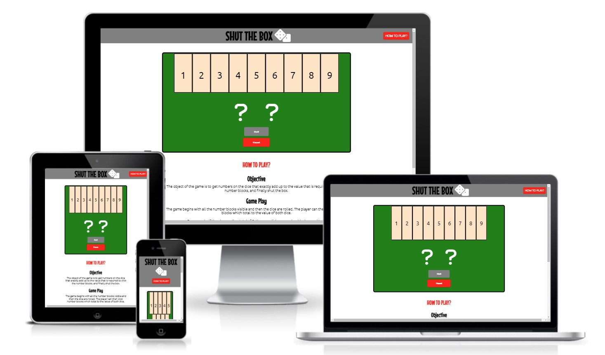
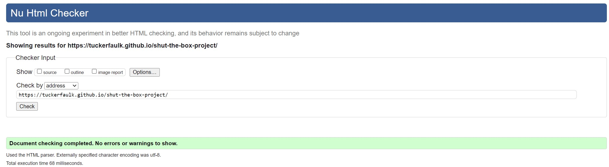
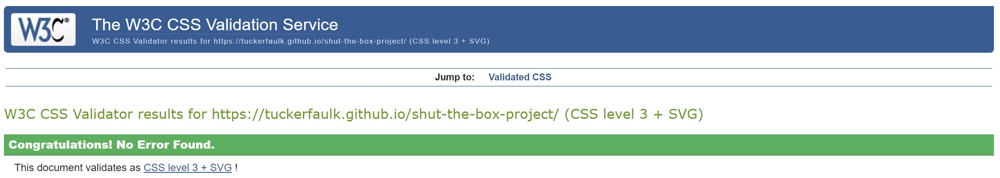
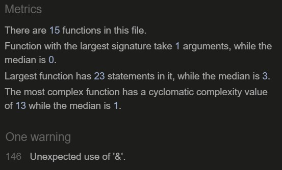
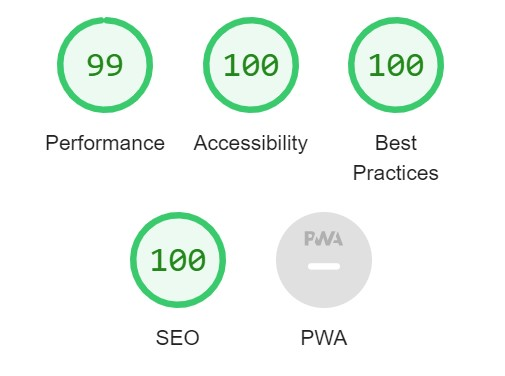

# Shut the Box | Dice Game! 

My idea for this project was to develop an online game of chance which players can enjoy: the game itself is a popular game played in Pub's in Suffolk.

The object of the game is to roll numbers on the dice that exactly add up to the value that is required to click all of the number blocks, and finally shut the box.

# Table of contents
<!-- - [Design](#design)
- [Features](#features)
  - [Existing Features](#existing-features)
    - [Languages Used](#languages-used)
    - [Navigation](#navigation)
    - [Home Page Hero Image](#home-page-hero-image)
    - [Home Page](#home-page)
    - [Footer](#footer)
    - [Buddhism and Meditation](#buddhism-and-meditation)
    - [Get in Touch](#get-in-touch)
  - [Future Features](#future-features)
- [Testing](#testing)
  - [Validator Testing](#validator-testing)
  - [Unfixed Bugs](#unfixed-bugs)
  - [Libraries & Programs Used](#libraries-and-programs-used)
- [Deployment](#deployment)
- [Credits](#credits)
  - [Content](#content)
  - [Media](#media) -->

# Design

**Text & Background Color**

<!-- Google Fonts: Font-family 'Mouse Memoirs' and 'Ubuntu' -->

<!-- I selected both the text and background colors to keep the website simple. I wanted to keep the main background white and introduce color into the website through the images used. I decided to use a light grey for the header and the footer to provide some contrast from the main sections. -->

**Game Area Design**

The game area is the main section of the site where the game can be played. The design of this area was based on the design of the Shut the Box board, as seen below.

<!--  -->

<!-- - Wireframing.  -->

After intially developing the game board area to exactly reflect the wireframing design, it was noted that by stacking the number blocks, dice and buttons, instead of having the dice and buttons next to each other, this significantly reduced on the changes required when adding the media queries and meant that the design remained consistent for the user across all screen sizes.

**Game Process Planning - Flow Chart**

<!-- Section intro -->

<!--  -->

After the site was developed inline with the inital flow chart planning, as seen above, after testing of the site, it was noted that further conditional checking was required to prevent game faults: details of these faults have been 

# Features

## Existing Features:

### Languages Used

- HTML5
- CSS3
- JavaScript

### Header (including Navigation)

<!-- Logo text and icon... -->

Although there is only a single page with the 'How to play?' game rules loacted under the game area, it was noted during testing that on screens sizes with a smaller height, it was not immediately evident that these rules were available. By adding this button to the header, this solved this problem and also provided the user which a shortcut to this section of the page.

### Game Area

- Game Board
- Number Blocks
- Dice Area (2 x Dice)
- Roll and Reset Buttons

<!-- A Hero Image is used on the Home Page (only) under the Header. The text over the Hero Image, 'Buddha - Dharma - Sangha', has been added to break up the image and has been included to improve the design. 'Buddha - Dharma - Sangha' are the Three Jewels of Buddhism and are an important part of the teachings.

 -->

### Pop-up messages (Game Won, Game Bust, and Alerts)

<!-- This page provides all the information a user will need about the group. Each of the questions a user may have about the group have been broken into sections to make it easy to read. This section has been kept simple and to the point. -->

#### How to play?

<!-- This section has been placed first to provide some context about the page and what the group is about. -->

<!--  -->

### Footer

The footer section features a note that this site is for educational purposes only and details the name of the creator.

<!--  -->

### Other Features

- Favicon: A Font Awesome Icon of two dice has been used for the Favicon as a finishing touch to the site.

## Future Features

<!-- - Highlighting of the numbers available to select
- Animations (Dice, card flip and Won Screen)
- Event listener for keyboard use of dice and numbers -->

# Testing

Testing of the website has been complete by myself and a few friends and family on various devices (Laptop, Tablet and Mobile). It is noted that the game and all of the pop-up messages (Game Won, Game Bust, and Alerts) functioned as expected.

To ensure that the website worked on different browsers than what was used for the development (Google Chrome), testing also took place on Microsoft Edge, Firefox and Safari.

Useful techniques used during the testing process:
- Writing pseudo code 
- Drawing function flow charts
- Adding console.log()s into functions

There were many bugs identified during the testing, development and from feedback of this site. These have been listed below:

<!-- 1. Event Listeners and removing event listeners -->

<!-- 2. Reset Game (Template Literal) -->

<!-- 3. Roll exactly the same number. -->

4. The game would not notify the user that they had bust if a combination of their remaining number blocks did not total to the dice total.

<!-- (Add image) -->

The solution to this was to use some code which created a new array of all combinations of an array of numbers. The original code used concatenated all cominations of a list of letters. This was update to collate an array of the remaining number blocks and then to add (instead of concatenate) all combinations of these numbers.

<!-- 5. If a user accidentally selected a number higher than the value of the dice... -->

<!-- 6. How to Play? Section covering the game area on smaller screens - block elements not stacking. The initial thought was that the above sections "position" or "display" setting was preventing the blocks from stacking. Solution: The game-area section height was detailed using "vh". Changing this to pixels fixed this bug. -->

<!-- 7. Comment on CSS Media Queries testing and the review of the game board design. -->

8. Feedback from testing of friends and family noted that using two dice with both a value of one on the loading page was slightly confusing: as if the game had already started. The solution to this was to change the starting icons from a pair of dice to two questions marks.

## Validator Testing

- HTML: No errors were returned when passing through the official W3C validator.

- CSS: No errors were found when passing through the official (Jigsaw) validator.

- JSHint: Only one warnings was returned using (JSHint) with "New JavaScript features (ES6)" activated in the configuration, although this is not an issue. It is noted that this was a deliberate use of the bitwise operator. 

- Lighthouse (Accessibility Audit): The page achieved a great accessibility performance.

## Unfixed Bugs

There were no unfixed bugs identified during the testing of this site.

## Libraries and Programs Used

- Github: Store Repository
- Gitpod: Create the html and css files
- Google Fonts: Font-family 'Mouse Memoirs' and 'Ubuntu'
<!-- - Google Chrome Dev Tools: To aid the initial styling for media queries and testing at various screen sizes -->
<!-- - Microsoft Edge, Mozilla Firefox, Safari: Site testing on alternative browsers -->
- Microsoft OneNote: Planning notes for the project
- Font Awesome: Icons used for Dice, Logo, and Favicon
- Gauger.io/fonticon/: Font Awesome Favicon Generator
- JavaScript coding tutor:
- Microsoft Whiteboard: Wireframing design and flow chart for game process planning
- Am I Responsive: Screenshots of the final project for the README file

# Deployment

The site was deployed to GitHub pages. The steps to deploy are as follows: 

  1. In the GitHub repository, navigate to the Settings tab. 
  2. From the settings tab, select the 'Pages' tab in the 'Code and Automation' section.
  3. From the source section drop-down menu, select the 'Main' branch.
  4. Once the 'Main' branch has been selected, the page will be automatically refreshed with a detailed ribbon display to indicate the successful deployment. 

The live link for the site can be found here - https://tuckerfaulk.github.io/shut-the-box-project/

# Credits

<!-- I have really enjoyed the Code Institute course up till now, and I am looking forward to the next units of the course. I wanted to thank the Slack Community for their support learning the content and my Mentor Martina for her guidance with this project and assurances that creating a website is not as scary as I initially thought. -->

## Content

Code used in the "checkNumberBlockArray()" JS Function (referenced in JS file) -- original code source: https://codereview.stackexchange.com/questions/7001/generating-all-combinations-of-an-array

## Media

Images:

- Shut the Box Board (Used in the READ.me file). Image source: https://www.gamesforyoungminds.com/blog/2017/11/30/shut-the-box
